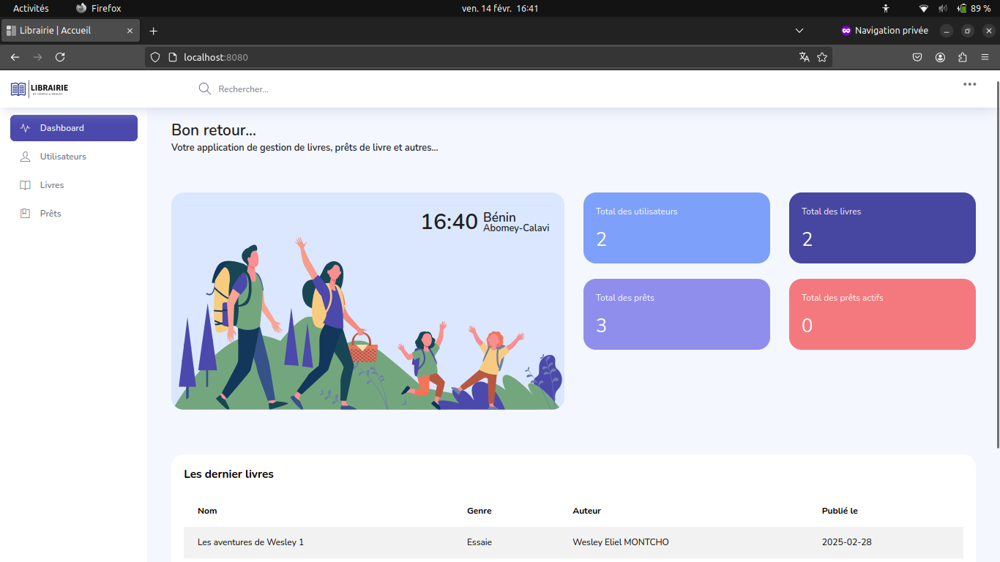
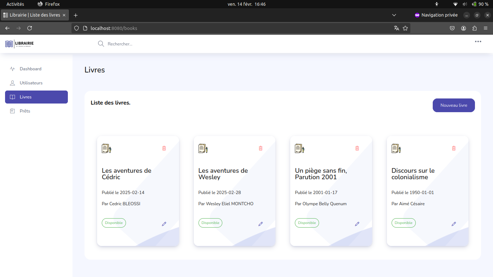
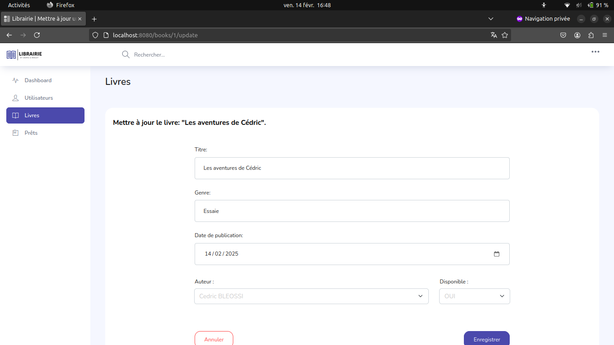
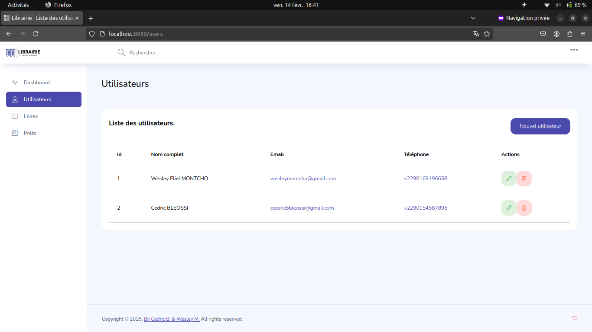
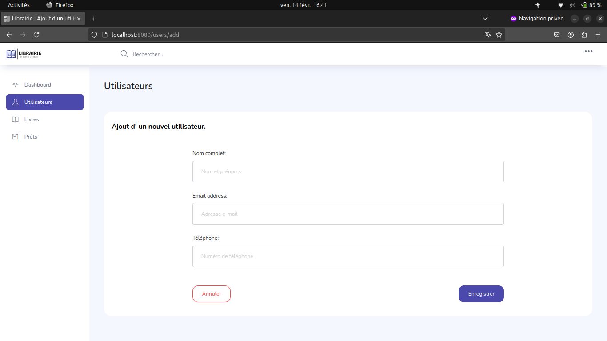
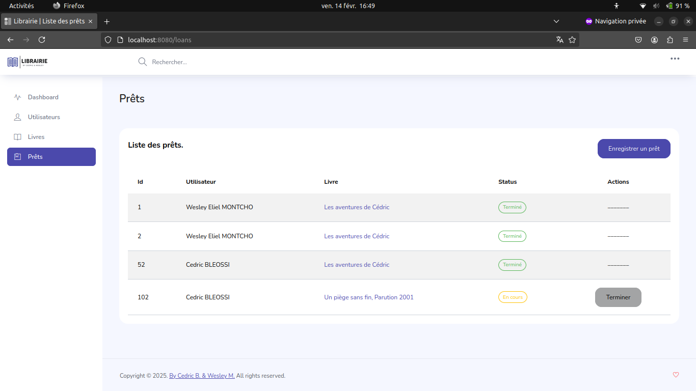
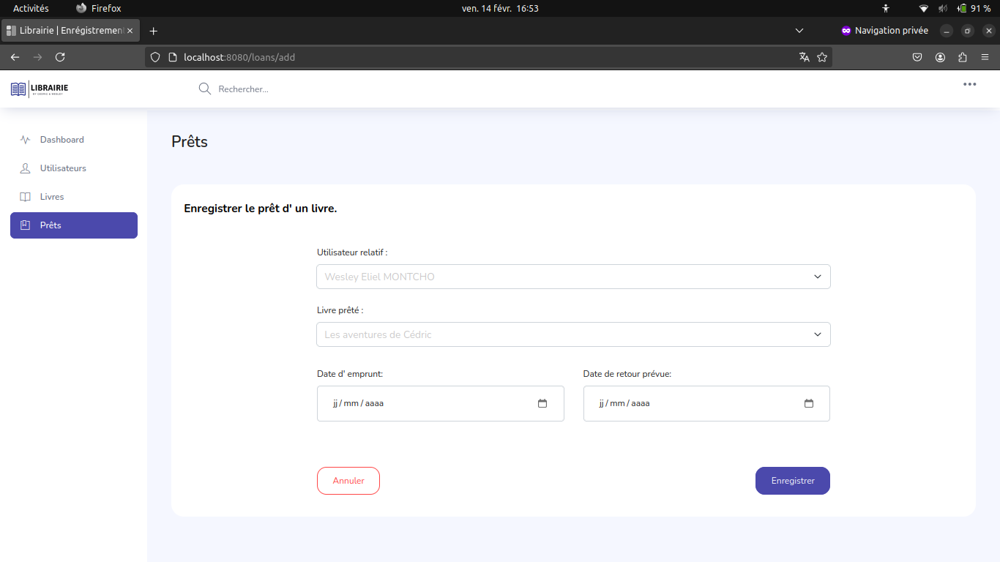

# ✨ CW | Librairie - Projet Final Outils Java IFRI 2024-2025 ✨

Bienvenue dans notre projet de gestion de librairie en Java Web. Cette application permet de gérer efficacement les
livres, les emprunts et les utilisateurs d'une bibliothèque.

---

## Membres du Binôme

- **Cedric A. BLEOSSI** - [https://github.com/dric2000](https://github.com/dric2000)
- **Wesley E. MONTCHO** - [https://github.com/WesleyEliel/](https://github.com/WesleyEliel/)

---

---

## Enseignant

- **Jean-Pierre KOUKPAKI**
---

## 💻 Technologies Utilisées

- **Langage :** Java (JDK 17)
- **Framework :** Spring, Spring Boot, Spring Web
- **Base de données :** Postgres SQL, JDBC

---

## ⚙️ Fonctionnalités Principales

- **Gestion des livres** (ajout, suppression, modification, liste)
- **Enregistrement des emprunts et mise à jour en cas de retour**
- **Gestion des utilisateurs (Auteur comme Utilisateurs simple)**
- **Interface utilisateur agréable et intuitive**

---

## 🚳️ Installation et Exécution

### ⚡ Prérequis

Avant de commencer, assurez-vous d'avoir :

- **Java Development Kit (JDK 17)**
- **Maven installé et bien configuré**
- **Postgres SQL** installé

### ⚡ Instructions

1. Importez le projet dans votre IDE
2. Mettez à jour selon les informations de votre service postgres les champs `spring.datasource:["url", "username", "password"]` dans le fichier `"/src/main/resources/application.properties"`
3. Mettez à jour les dependence avec Maven
4. Exécutez la classe principale : `LibraryManagementApplication.java` dont le chemin d'accès est `/src/main/java/bj/ifri/library_management/LibraryManagementApplication.java`

---

## 📸 Captures d'écran

### Accueil

### Livres
#### Liste

#### Formulaire

### Utilisateurs
#### Liste

#### Formulaire

### Prêts
#### Liste

#### Formulaire

---

## 🔧 Problèmes & Améliorations Futures

### Problèmes
- ❌ Nous avons dû faire les mises à jour des lignes dans la db à travers les objets objects de façon manuelle avec les getters et les setters : (Ça aurait été façile s'il y avait une méthode update)
- ❌ Nous avons rencontré de petite difficulté à intégrer les fichiers statics, mais l'avons fait à la fin
- ❌ Nous nous sommes demandé s'il n'y avait pas moyen de mettre en place, un live reloading du serveur au fur et à mesure que les modifications sont faites 

### En termes amelioration envisagées
- ✅ Mettre en place un système authentication avec des rôles et accès bien définis
- ✅ Gérer la pagination (Nous avons essayé quelque chose, mais n'avons pas intégré le processus de pagination au font end )
- ✅ Mettre en place une fonctionnalité de recherche pour apprendre une manipulation avancée des **`repositoties`**
- ✅ Configurer docker et docker-compose pour faciliter l'exportation de l'application sur different os

---

## 🔍 Ce que nous avons appris

Ce projet nous a permis d'explorer de notre propre chef eco système des applications web avec java, d'apprendre à debugger les erreurs Java, et à manipuler les objects Java
Par ailleurs nous nous somme familiarisé avec le système de templatage jsp

---

## 🌟 **Projet réalisé dans le cadre du cours de ** _Outils Java_**.**

